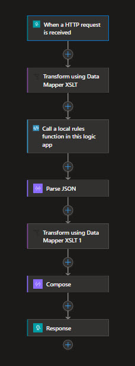

## DESCRIPTION

This is an enhanced version of the preview Logic Apps Rules Engine workspace template.

It expands on the very basic default Logic App implemented by the template, removing the hard-coded function parameters and making both the input and the output more readable JSON. 



For more details about this Azure feature, see the [official Microsoft documentation](https://learn.microsoft.com/en-us/azure/logic-apps/rules-engine/create-rules-engine-project#create-an-azure-logic-apps-rules-engine-project).

## USAGE

The following sample request can be used to invoke the Logic App and test the rules:

```
{
    "UserDetails": {
        "Age": 70,
        "Name": "John Doe",
        "ZipCode": "98052"
    },
    "Status": {
        "Gold": false,
        "Discount": 0
    },
    "PurchaseAmount": 900
}
```
